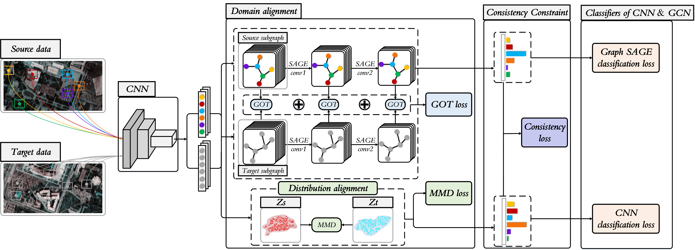

# Topological Structure and Semantic Information Transfer Network for Cross-Scene Hyperspectral Image Classification

Code for the paper: [Topological Structure and Semantic Information Transfer Network for Cross-Scene Hyperspectral Image Classification](https://ieeexplore.ieee.org/document/9540028).

<p align='center'>
  
</p>

## Abstract

Domain adaptation techniques have been widely applied to the problem of cross-scene hyperspectral image (HSI) classification. Most existing methods use convolutional neural  networks (CNN) to extract statistical features from data and often neglect the potential topological structure information between different land cover classes. CNN-based approaches generally only model the local spatial relationships of the samples, which largely limits their ability to capture the non-local topological relationship that would better represent the underlying data structure of HSI. In order to make up for the above shortcomings, a Topological structure and Semantic information Transfer network (TSTnet) is developed. The method employs the graph structure to characterize topological relationships and the graph convolutional network (GCN) that is good at processing for crossscene HSI classification. In the proposed TSTnet, graph optimal transmission (GOT) is used to align topological relationships to assist distribution alignment between source domain and target domain based on maximum mean difference (MMD). Furthermore, subgraphs from source domain and target domain are dynamically constructed based on CNN features to take advantage of the discriminative capacity of CNN models that in turn improves robustness of classification. In addition, to better characterize the correlation between distribution alignment and topological relationship alignment, a consistency constraint is enforced to integrate the output of CNN and GCN. Experimental  results on three cross-scene HSI datasets demonstrate that the proposed TSTnet performs significantly better than some state-of-the-art domain-adaptive approaches.


## Paper

Please cite our paper if you find the code or dataset useful for your research.

```
@ARTICLE{9540028,
  author={Zhang, Yuxiang and Li, Wei and Zhang, Mengmeng and Qu, Ying and Tao, Ran and Qi, Hairong},
  journal={IEEE Transactions on Neural Networks and Learning Systems}, 
  title={Topological Structure and Semantic Information Transfer Network for Cross-Scene Hyperspectral Image Classification}, 
  year={2021},
  volume={},
  number={},
  pages={1-14},
  doi={10.1109/TNNLS.2021.3109872}}
```

## Requirements

CUDA Version: 10.2

torch: 1.6.0

tensorboard 2.6.0

Python: 3.6.5

torch-geometric: 1.6.3

## Dataset

The dataset directory should look like this:
```bash
datasets
├── Houston
│   ├── Houston13.mat
│   ├── Houston13_7gt.mat
│   ├── Houston18.mat
│   └── Houston18_7gt.mat
├── Shanghai_Hangzhou
│   ├── Shanghai.mat
│   └── Shanghai_gt.mat
│   ├── Hangzhou.mat
│   └── Hangzhou_gt.mat
└──  HyRANK
    ├── Dioni.mat
    └── Dioni_gt_out68.mat
    ├── Loukia.mat
    └── Loukia_gt_out68.mat
```

## Usage

1.You can download [HyRANK](https://zenodo.org/record/1222202) dataset here. And then unrar dataset in ./dataset/.

2.You can change the source_name and target_name in train.py to set different transfer tasks.

3.Run python train.py.

## Results

```bash
# Default results directory is:
./results
```

```bash
# Default logs directory is:
./logs
```

## Note

- The variable names of data and gt in .mat file are set as `ori_data` and `map`.
- `batch_size` needs to be set to 64, 100 and 256, etc. with integer square roots.
- `re_ratio` corresponding to the Houston data is 20; for the HyRANK data, it is 10; for the Shanghai-Hangzhou data, it is 2.
- The HyRANK dataset is screened for classes and samples. The gt used in the experiment is placed in `./dataset/HyRANK/`.
- The dataset, model, and code are for non-commercial research purposes only.
